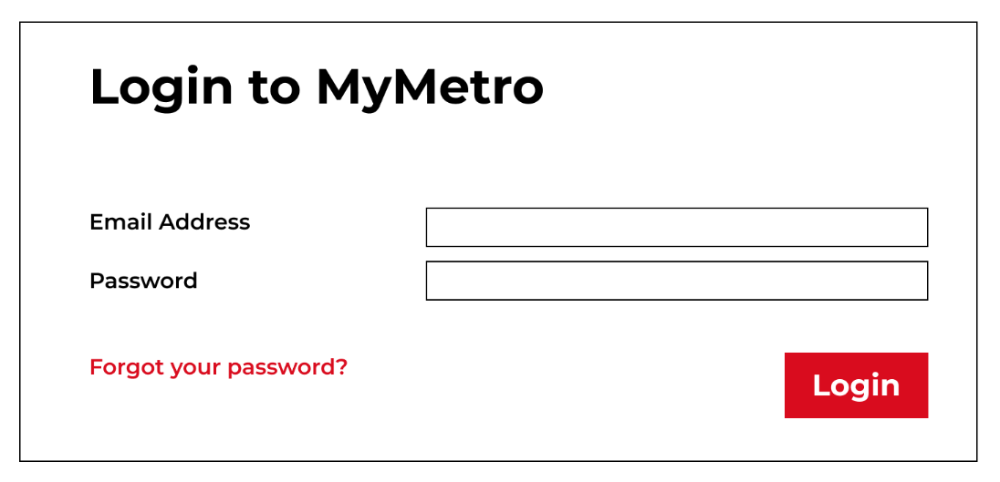
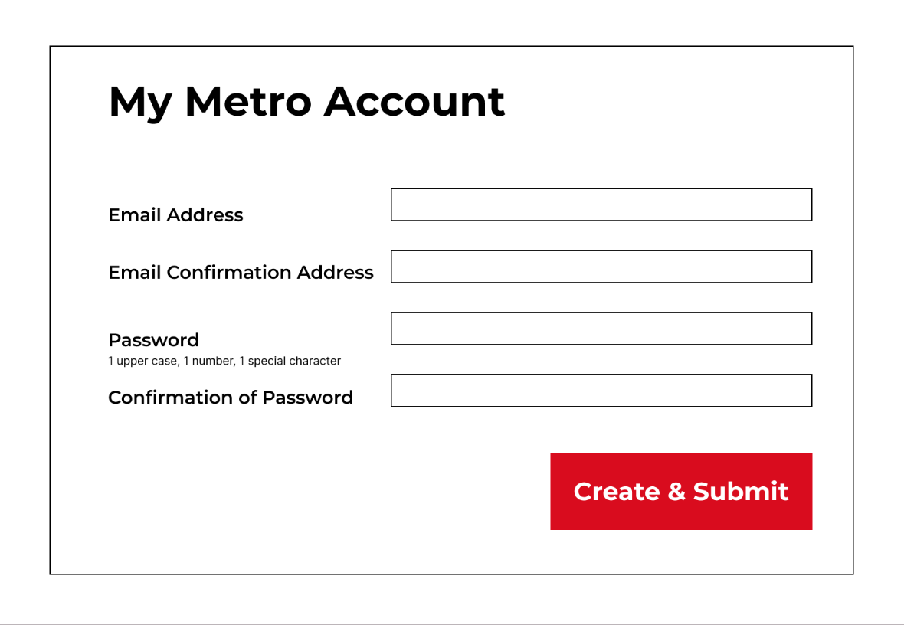
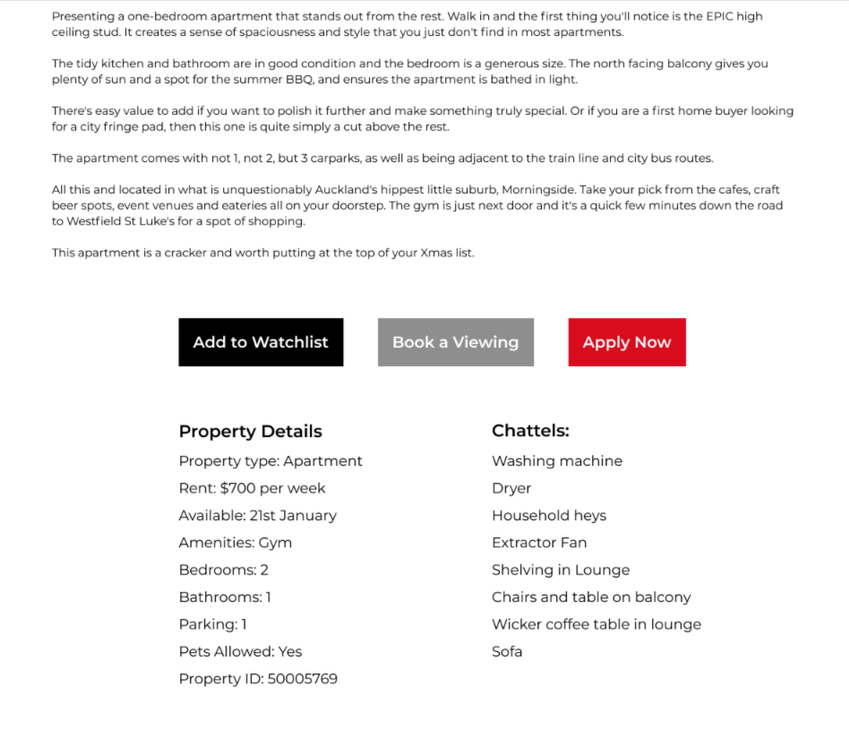

<a name="readme-top"></a>

[![Contributors][contributors-shield]][contributors-url]
[![LinkedIn][linkedin-shield]][linkedin-url]


<!-- PROJECT LOGO -->
<br />
<div align="center">

<h3 align="center">Mission 5</h3>

  <p align="center">
    Full Stack Dockerised Webpage
    <br />
    <a href="https://github.com/ClydeyBoy/mission-5"><strong>Explore the docs »</strong></a>
    <br />
    <br />
    <a href="https://github.com/ClydeyBoy/mission-5">View Demo</a>
    ·
    <a href="https://github.com/ClydeyBoy/mission-5/issues">Report Bug</a>
    ·
    <a href="https://github.com/ClydeyBoy/mission-5/issues">Request Feature</a>
  </p>
</div>


<!-- TABLE OF CONTENTS -->
<details>
  <summary>Table of Contents</summary>
  <ol>
    <li>
      <a href="#about-the-project">About The Project</a>
      <ul>
        <li><a href="#built-with">Built With</a></li>
      </ul>
    </li>
    <li>
      <a href="#getting-started">Getting Started</a>
      <ul>
        <li><a href="#prerequisites">Prerequisites</a></li>
        <li><a href="#installation">Installation</a></li>
      </ul>
    </li>
    <li><a href="#usage">Usage</a></li>
    <li><a href="#contact">Contact</a></li>
  </ol>
</details>


<!-- ABOUT THE PROJECT -->
## About The Project

A Property listing webpage displaying login/signup and post tenancy application functionality in a dockerised MERN Stack. 
<br>
Created this application based on the first version of a prototype design received from the team's UX Designers. Link to first version of prototype: https://app.zeplin.io/project/63b152a75ece068ff046eddd/dashboard?sid=63b15925f1fa821c63054813
<br>
Design changes made by the UX Designers after the first prototype have not been incorporated into the web page - as per the mission brief.


<br>

![Product Name Screen Shot][product-screenshot] 

<p align="right">(<a href="#readme-top">back to top</a>)</p>


### Built With

* [![React][React.js]][React-url]


<p align="right">(<a href="#readme-top">back to top</a>)</p>


<!-- GETTING STARTED -->
## Getting Started

To get a copy up and running in a docker container follow the simple steps below:

### Prerequisites
You will need the following programmes to run the project:

* Docker desktop application: <br>
  https://www.docker.com/

### Installation

1. Initialise your local Git
   ```sh
   git init
   ```

2. Clone the repo
   ```sh
   git clone https://ClydeyBoy/mission-5.git
   ```

3. Create and run docker containers
   ```sh
   docker compose up
   ```

<p align="right">(<a href="#readme-top">back to top</a>)</p>


<!-- USAGE EXAMPLES -->
## Usage

The web application allows for login and signup functionality.
Please note that there is a small bug in the login, where one must refresh the browser after logging in/signing up to access protected routes (i.e. the profile page route).





Viewing property information:



And posting tenancy applications:

![Product Name Screen Shot][application-screenshot] 

<p align="right">(<a href="#readme-top">back to top</a>)</p>


<!-- CONTACT -->
## Contact

Clyde D'Souza - [@Linkedin](https://www.linkedin.com/in/clyde-d-a1a609116/) - clydedesouza89@gmail.com

Project Link: [https://github.com/ClydeyBoy/mission-5/](https://github.com/ClydeyBoy/mission-5/)

<p align="right">(<a href="#readme-top">back to top</a>)</p>


<!-- MARKDOWN LINKS & IMAGES -->
<!-- https://www.markdownguide.org/basic-syntax/#reference-style-links -->
[contributors-shield]: https://img.shields.io/github/contributors/ClydeyBoy/mission-5.svg?style=for-the-badge
[contributors-url]: https://github.com/ClydeyBoy/mission-5/graphs/contributors
[forks-shield]: https://img.shields.io/github/forks/github_username/repo_name.svg?style=for-the-badge
[forks-url]: https://github.com/ClydeyBoy/mission-5/network/members
[stars-shield]: https://img.shields.io/github/stars/github_username/repo_name.svg?style=for-the-badge
[stars-url]: https://github.com/ClydeyBoy/mission-5/stargazers
[issues-shield]: https://img.shields.io/github/issues/github_username/repo_name.svg?style=for-the-badge
[issues-url]: https://github.com/ClydeyBoy/mission-5/issues
[license-shield]: https://img.shields.io/github/license/github_username/repo_name.svg?style=for-the-badge
[license-url]: https://github.com/ClydeyBoy/mission-5/blob/master/LICENSE.txt
[linkedin-shield]: https://img.shields.io/badge/-LinkedIn-black.svg?style=for-the-badge&logo=linkedin&colorB=555
[linkedin-url]: https://linkedin.com/in/linkedin_username
[product-screenshot]: images/screenshot.png
[application-screenshot]: images/application.png
[property-info-screenshot]: images/property_info.png
[React.js]: https://img.shields.io/badge/React-20232A?style=for-the-badge&logo=react&logoColor=61DAFB
[React-url]: https://reactjs.org/
